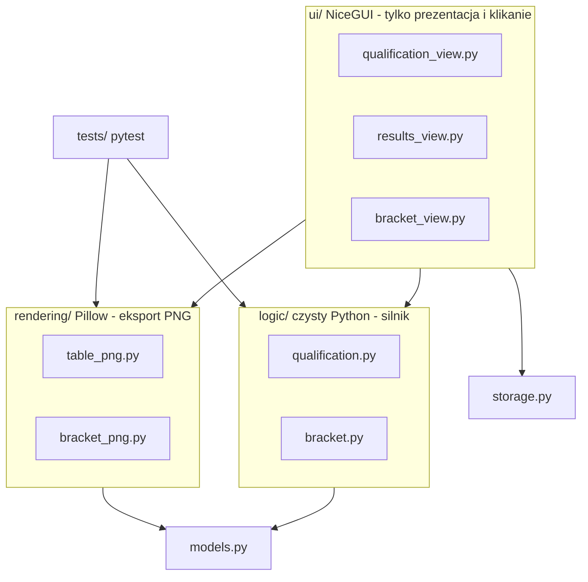
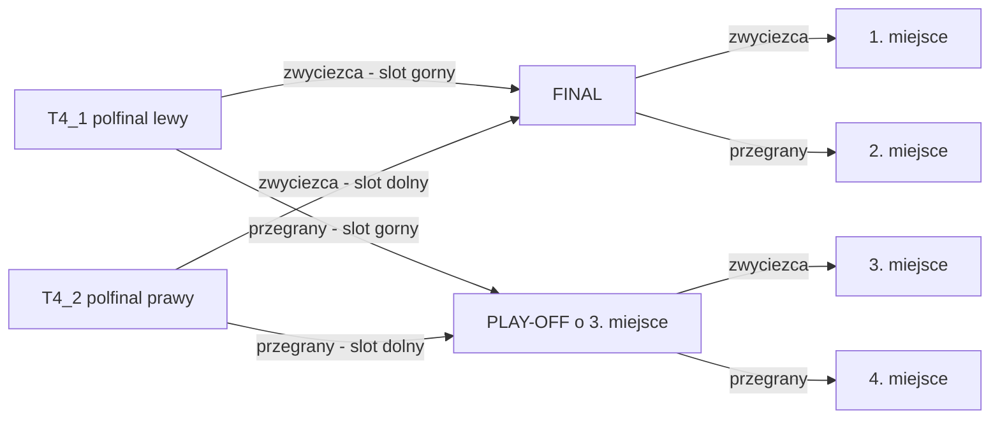

# Aplikacja "Wyniki i drabinka TOP32" — architektura i backlog mentorski

Plan dla studenta 2. roku realizującego samodzielnie aplikację do zawodów driftingowych wg wymagań z [Program do wyników i drabinka.md](Program do wyników i drabinka.md).

**Zasada przewodnia:** najpierw silnik logiki w czystym Pythonie (testowalny, działający w konsoli od pierwszego tygodnia), potem interfejs, na końcu estetyka i eksport PNG. Po każdym tickecie program musi się uruchamiać.

---

## 1. Architektura i wybór stosu technologicznego

### 1.1 Rekomendowany stack

- **Python 3.12+**
- **NiceGUI 3.x** — interfejs użytkownika. Czysty Python (zero HTML/JS), aplikacja działa lokalnie w przeglądarce, a jedną flagą `ui.run(native=True)` zamienia się w okno desktopowe na Windows/macOS (spełnia oba warianty z wymagań). Oficjalne narzędzie `nicegui-pack` (nakładka na PyInstaller) buduje samodzielny plik wykonywalny.
- **Pillow** — eksport przezroczystych PNG. Kluczowa decyzja: **PNG nie jest screenshotem interfejsu**, tylko obrazem rysowanym programowo na płótnie RGBA `(0,0,0,0)`. Daje to stuprocentową kontrolę nad przezroczystością i pozwala testować eksport bez uruchamiania UI.
- **pytest** — testy jednostkowe logiki (sortowanie i drabinka to serce projektu).
- **JSON w pliku** — autozapis stanu zawodów (bez bazy danych; jedne zawody = jeden plik).

Odrzucone alternatywy (dlaczego):

- **Flet** — API zmienia się między wersjami, a wygenerowanie przezroczystego PNG z UI jest trudne.
- **FastAPI + HTML/Tailwind** — dwa języki i frontend do nauczenia; eksport przez `html2canvas` bywa kapryśny z przezroczystością.
- **Tkinter** — dynamiczne tabele i nowoczesny wygląd to walka z frameworkiem; eksport canvas wymaga ghostscriptu.

### 1.2 Struktura projektu (separacja warstw)

```
drift_app/
├── main.py                  # start NiceGUI (ui.run)
├── models.py                # dataclasses: Driver, QualificationResult, Match, TournamentBracket
├── logic/
│   ├── qualification.py     # sortowanie, remisy, podział 1-32 / 33+
│   └── bracket.py           # rozstawienie TOP32, przepływ zwycięzców, finał/play-off
├── rendering/
│   ├── table_png.py         # Pillow: tabela wyników → przezroczyste PNG
│   └── bracket_png.py       # Pillow: drabinka → przezroczyste PNG
├── ui/
│   ├── state.py             # AppState – jedyne źródło prawdy o stanie aplikacji
│   ├── qualification_view.py
│   ├── results_view.py
│   └── bracket_view.py
├── storage.py               # autozapis/odczyt JSON
├── assets/fonts/            # pliki .ttf (regular + bold) dołączone do repo
├── tests/
└── requirements.txt         # nicegui>=3, pillow, pytest
```

Żelazna reguła: **`logic/` i `rendering/` nie importują niczego z `ui/`** — działają i są testowane bez GUI.



### 1.3 Model danych

```python
from dataclasses import dataclass, field

@dataclass(frozen=True)
class Driver:
    id: int          # stała tożsamość nadawana przy wpisaniu — NIE mylić z miejscem w tabeli!
    name: str        # "Jan Kowalski #77" — jedno pole, dokładnie jak w tabeli klienta

@dataclass
class QualificationResult:
    driver: Driver
    run1: int = 0    # puste pole w UI = 0 w momencie generowania wyników
    run2: int = 0

    @property
    def best(self) -> int:  return max(self.run1, self.run2)
    @property
    def worst(self) -> int: return min(self.run1, self.run2)
    @property
    def is_zero(self) -> bool: return self.run1 == 0 and self.run2 == 0

@dataclass
class Match:
    match_id: str                                  # "T32_1".."T32_16", "T16_1".."T16_8",
                                                   # "T8_1".."T8_4", "T4_1", "T4_2", "FINAL", "PLAYOFF"
    slot_top: Driver | None = None                 # None = "-" (wolne miejsce)
    slot_bottom: Driver | None = None
    winner: Driver | None = None
    winner_goes_to: tuple[str, str] | None = None  # (id_meczu, "top"|"bottom")
    loser_goes_to: tuple[str, str] | None = None   # wypełnione tylko dla T4_1 i T4_2 → PLAY-OFF

@dataclass
class TournamentBracket:
    matches: dict[str, Match] = field(default_factory=dict)
    podium: dict[int, Driver | None] = field(
        default_factory=lambda: {1: None, 2: None, 3: None, 4: None})
```

Konwencje: `None` w slocie renderuje się jako "-"; drabinka trzyma **referencje do `Driver`**, nigdy numery miejsc (miejsca zmieniają się przy ponownym sortowaniu, tożsamość nie).

---

## 2. Logika algorytmiczna

### 2.1 Sortowanie kwalifikacji z rozstrzyganiem remisów

Klucz sortowania: malejąco po lepszym przejeździe, przy remisie malejąco po słabszym przejeździe. Przykład ze specyfikacji: `(81,76)` przed `(56,81)` przed `(81,0)` — wszyscy mają best 81 lub mniej, a o kolejności 1 vs 3 decyduje worst 76 > 0.

```python
def sort_key(r: QualificationResult) -> tuple[int, int]:
    return (-r.best, -r.worst)

def split_standings(results: list[QualificationResult]
                    ) -> tuple[list[QualificationResult | None], list[QualificationResult]]:
    """Zwraca (miejsca 1-32, miejsca 33+).
    None w tabeli głównej = wiersz wypełniony myślnikami."""
    scored = sorted((r for r in results if not r.is_zero), key=sort_key)
    zeros  = [r for r in results if r.is_zero]
    main   = (scored[:32] + [None] * 32)[:32]   # zawsze dokładnie 32 pozycje
    extra  = scored[32:] + zeros                # numeracja od 33
    return main, extra
```

- `sorted()` jest **stabilne** — przy pełnym remisie (identyczna para wyników) wygrywa kolejność wpisania. To świadomy fallback do potwierdzenia z klientem (sekcja 4.2).
- Wiersze bez wpisanego nazwiska są odfiltrowywane przed sortowaniem.
- Tabela 33+ zawiera zerowych `(0,0)`; nadmiar powyżej 32 dodatnich wyników też tam trafia (decyzja domyślna, do potwierdzenia).

### 2.2 Rozstawienie drabinki TOP32

Schemat z grafiki klienta — każda para sumuje się do 33, kolejność wyświetlania:

```python
SEED_PAIRS: list[tuple[int, int]] = [
    (1, 32), (16, 17), (8, 25), (9, 24), (4, 29), (13, 20), (5, 28), (12, 21),   # lewe skrzydło:  T32_1..T32_8
    (2, 31), (15, 18), (7, 26), (10, 23), (3, 30), (14, 19), (6, 27), (11, 22),  # prawe skrzydło: T32_9..T32_16
]
```

`create_bracket(main_standings)` tworzy 32 mecze (16 × T32, 8 × T16, 4 × T8, 2 × T4, FINAL, PLAYOFF) i wpisuje zawodników wg seedów; brakujący seed (np. miejsca 29–32 przy 28 zawodnikach) = `None` = "-".

Test poprawności schematu: gdy zawsze wygrywa wyższy seed, pary kolejnych rund to T16: 1v16, 8v9, 4v13, 5v12 / 2v15, 7v10, 3v14, 6v11; T8: 1v8, 4v5 / 2v7, 3v6; T4: 1v4 / 2v3; FINAŁ: 1v2.

### 2.3 Drzewo meczów i przepływ zwycięzca/przegrany

Reguła ogólna dla rund T32→T16→T8→T4: **zwycięzca meczu nr `i` trafia do meczu nr `(i+1)//2` następnej rundy, do slotu górnego gdy `i` nieparzyste, dolnego gdy parzyste** (numeracja ciągła: lewe skrzydło, potem prawe). Środek drabinki to wyjątek, dokładnie wg szkicu klienta:



### 2.4 Rozstrzyganie meczu i korekta pomyłki (kaskadowe czyszczenie)

```python
def set_winner(bracket: TournamentBracket, match_id: str, side: str) -> None:
    match = bracket.matches[match_id]
    clicked = match.slot_top if side == "top" else match.slot_bottom
    if clicked is None or clicked == match.winner:
        return                                  # klik na "-" albo ponowny klik: nic nie rób
    if match.winner is not None:
        clear_downstream(bracket, match)        # KOREKTA: usuń skutki starej decyzji
    match.winner = clicked
    loser = match.slot_bottom if side == "top" else match.slot_top
    place(bracket, match.winner_goes_to, clicked)   # następna runda / FINAL / podium 1
    place(bracket, match.loser_goes_to, loser)      # tylko T4 → PLAY-OFF; FINAL/PLAYOFF → podium
```

`clear_downstream` (najtrudniejszy fragment projektu): idź wzdłuż `winner_goes_to`/`loser_goes_to`, usuń starego zawodnika z docelowego slotu; jeśli mecz docelowy miał już rozstrzygnięcie zależne od tego slotu — wyzeruj jego `winner` i **rekurencyjnie czyść dalej**, łącznie z podium. Bez tego po zmianie decyzji w TOP32 "duch" zawodnika zostaje w TOP8.

Walkower (bye): mecz `zawodnik vs "-"` rozstrzyga się normalnym kliknięciem na zawodnika; mecz `"-" vs "-"` pozostaje nierozstrzygnięty i propaguje "-" dalej.

---

## 3. Roadmapa: milestones i tickety

Szacunki przy pracy ~2–3 h dziennie. Po każdym tickecie: commit + zielone `pytest`.

### Milestone 0 — Fundament (1 dzień)

**T-01: Inicjalizacja projektu**
- Opis: repozytorium git, venv, `requirements.txt` (`nicegui>=3`, `pillow`, `pytest`), struktura katalogów z sekcji 1.2, `main.py` pokazujący "Hello" w NiceGUI, jeden test smoke.
- DoD:
  - `pip install -r requirements.txt` przechodzi na czystym venv;
  - `pytest` — 1 test zielony;
  - `python main.py` otwiera stronę z napisem;
  - pierwszy commit istnieje.

### Milestone 1 — Silnik logiki bez UI (ok. 1 tydzień)

**T-02: Modele danych (`models.py`)**
- Opis: dataclasses z sekcji 1.3 z pełnymi adnotacjami typów.
- DoD (testy jednostkowe):
  - `(81,76)` → best 81, worst 76; `(0,81)` → best 81, worst 0; `(0,0)` → `is_zero == True`;
  - `Driver` jest frozen (próba modyfikacji rzuca wyjątek).

**T-03: Sortowanie kwalifikacji (`logic/qualification.py`)**
- Opis: `sort_key` + sortowanie malejące wg (best, worst).
- DoD (testy):
  - przykład ze specyfikacji: `(81,76)` przed `(56,81)` przed `(81,0)`;
  - pełny remis dwóch zawodników `(81,76)` — zachowana kolejność wpisania;
  - `(0,81)` sortuje się jak best=81, a nie jak zero.

**T-04: Podział na tabele 1–32 i 33+ z myślnikami**
- Opis: `split_standings` z sekcji 2.1; wiersze bez nazwiska ignorowane.
- DoD (testy):
  - 28 dodatnich → pozycje 1–28 wypełnione, 29–32 = `None`;
  - 5 zerowych → w drugiej tabeli, numeracja zaczyna się od 33;
  - 0 zawodników → 32 × `None` i pusta lista 33+;
  - 35 dodatnich → 3 nadmiarowych na początku listy 33+.

**T-05: Generator drabinki (`logic/bracket.py` — `create_bracket`)**
- Opis: stała `SEED_PAIRS`, utworzenie 32 meczów z powiązaniami `winner_goes_to`/`loser_goes_to` (reguła `(i+1)//2` + środek wg sekcji 2.3).
- DoD (testy):
  - `T32_1` = seed 1 vs 32; `T32_2` = 16 vs 17; `T32_9` = 2 vs 31;
  - przy 28 zawodnikach seedy 29–32 są `None` dokładnie w meczach `T32_5`, `T32_13`, `T32_9`, `T32_1` (dolne sloty);
  - zwycięzcy `T32_1` i `T32_2` wskazują na `T16_1` (góra/dół); `T4_1` ma `loser_goes_to = ("PLAYOFF", "top")`.

**T-06: Rozstrzyganie meczów i przepływ do podium (`set_winner`)**
- Opis: funkcja z sekcji 2.4 wraz z `clear_downstream`.
- DoD (testy):
  - symulacja pełnego turnieju "zawsze wygrywa wyższy seed" → FINAŁ to 1 vs 2, podium: 1., 2., 3., 4. zgodne z przepływem;
  - przegrany `T4_1` ląduje w `PLAYOFF` na górze, przegrany `T4_2` na dole;
  - klik na slot `None` nie zmienia niczego;
  - korekta: po rozstrzygnięciu finału zmiana zwycięzcy `T32_1` czyści całą ścieżkę aż do podium, a mecze niezależne pozostają nietknięte.

**T-07: Prototyp konsolowy (pierwszy działający produkt)**
- Opis: `cli_demo.py` — przykładowi zawodnicy na sztywno, wydruk tabeli wyników, pętla rozstrzygania meczów przez `input()` (numer meczu + strona), tekstowy wydruk drabinki.
- DoD:
  - da się przejść całe zawody od kwalifikacji do podium w terminalu;
  - błędne wejście (zły numer meczu, literówka) nie wywala programu.

### Milestone 2 — UI kwalifikacji (ok. 1 tydzień)

**T-08: Szkielet aplikacji i nawigacja**
- Opis: trzy zakładki ("Kwalifikacje", "Wyniki", "Drabinka TOP32"); klasa `AppState` w `ui/state.py` jako jedyne źródło stanu przekazywane widokom.
- DoD:
  - aplikacja startuje, zakładki przełączają się bez błędów w konsoli;
  - stan trzymany wyłącznie w `AppState` (żadnych rozsianych zmiennych globalnych).

**T-09: Dynamiczna tabela wprowadzania wyników**
- Opis: wiersze `[L.p. | Imię i nazwisko nr startowy | Wynik 1 | Wynik 2]`; start = 2 wiersze; gdy ostatni wiersz dostaje niepuste nazwisko, pod spodem pojawia się nowy z kolejnym L.p. (w NiceGUI: `@ui.refreshable` + handler `on_change`); pola wyników przyjmują tylko liczby całkowite 0–100.
- DoD:
  - wpisanie nazwiska w ostatnim wierszu natychmiast dodaje nowy wiersz z poprawnym L.p.;
  - tekst/liczby ujemne/większe niż 100 w polach wyników są odrzucane;
  - edycja wcześniejszych wierszy działa (nie tylko ostatniego), a nowe wiersze nie dublują się przy szybkim wpisywaniu.

**T-10: Widok tabeli wyników**
- Opis: zakładka "Wyniki" z przyciskiem "Generuj wyniki": tabela miejsc 1–32 (myślniki za puste) + osobna tabela 33+ dla `(0,0)`; wyższy wynik zawodnika pogrubiony (przy równych 81/81 — oba pogrubione).
- DoD:
  - kolejność identyczna jak w testach z T-03/T-04 dla tych samych danych;
  - pogrubienie zawsze na wyższym z dwóch wyników;
  - przy 28 zawodnikach wiersze 29–32 pokazują "-" we wszystkich kolumnach;
  - tabela 33+ pojawia się tylko, gdy istnieją wyniki zerowe.

### Milestone 3 — UI drabinki (ok. 1 tydzień)

**T-11: Statyczny widok drabinki TOP32**
- Opis: układ kolumnowy — lewe skrzydło (T32→T16→T8→T4), środek (FINAŁ, PLAY-OFF, podium 1–4), prawe skrzydło lustrzanie; karta meczu = dwa klikalne sloty; przycisk "Generuj drabinkę z wyników". W UI wystarczą karty w kolumnach bez rysowania linii — wersja "ładna" z liniami powstanie w PNG (T-14).
- DoD:
  - rozstawienie zgodne ze schematem (1v32 na górze po lewej, 2v31 na górze po prawej itd.);
  - puste seedy wyświetlają "-";
  - ponowne kliknięcie "Generuj drabinkę" pokazuje ostrzeżenie, że skasuje rozegrane pojedynki;
  - całość czytelna na ekranie laptopa.

**T-12: Interaktywne rozstrzyganie pojedynków**
- Opis: klik na slot = zwycięstwo → wywołanie `set_winner` z logiki i odświeżenie widoku; wyróżnienie zwycięzcy; podium wypełnia się po FINALE i PLAY-OFFIE; zmiana decyzji przez klik na drugiego zawodnika.
- DoD:
  - pełny turniej klikalny od T32 do podium 1–4;
  - klik na "-" nic nie robi; walkower (zawodnik vs "-") działa;
  - zmiana zwycięzcy w dowolnym meczu poprawnie czyści dalsze rundy w UI (widok = stan logiki);
  - po finale wypełnione miejsca 1. i 2., po play-offie 3. i 4.

### Milestone 4 — Eksport przezroczystych PNG (ok. 1 tydzień)

**T-13: Render tabeli wyników do PNG (`rendering/table_png.py`)**
- Opis: płótno `Image.new("RGBA", size, (0,0,0,0))`; fonty `.ttf` (regular + bold, np. DejaVu Sans lub Inter) w `assets/fonts/` — pogrubienie to **osobny plik fontu**, Pillow nie emuluje bolda; render tabel 1–32 i 33+; rysowanie w skali 2x dla ostrości.
- DoD:
  - PNG otwarty w podglądzie ma przezroczyste tło (szachownica), zero białych prostokątów;
  - lepszy wynik pogrubiony;
  - długie nazwisko nie wychodzi poza kolumnę (przycięcie lub pomniejszenie fontu);
  - test zapisuje plik bez uruchamiania UI i sprawdza tryb "RGBA".

**T-14: Render drabinki do PNG (`rendering/bracket_png.py`)**
- Opis: geometria: kolumna na rundę, pozycja Y meczu = średnia Y meczów zasilających; linie łączące `ImageDraw.line`; środek z FINAŁEM, PLAY-OFFEM i podium; render dowolnego stanu (pustego, częściowego, zakończonego).
- DoD:
  - PNG przezroczysty i czytelny przy szerokości ~1920 px;
  - obraz odzwierciedla aktualny stan drabinki łącznie z "-";
  - linie poprawnie łączą rundy (inspekcja wzrokowa; przykładowy plik zapisany w repo);
  - render działa bez uruchomionego UI.

**T-15: Przyciski eksportu w UI**
- Opis: "Eksportuj wyniki (PNG)" i "Eksportuj drabinkę (PNG)"; zapis z nazwą zawierającą datę; powiadomienie ze ścieżką zapisanego pliku.
- DoD:
  - klik tworzy plik, który otwiera się poprawnie;
  - eksport działa dla drabinki pustej i częściowo rozegranej;
  - dwa szybkie kliki nie nadpisują pliku (unikalne nazwy).

### Milestone 5 — Trwałość, desktop, domknięcie (3–5 dni)

**T-16: Autozapis i wczytywanie stanu (`storage.py`)**
- Opis: zapis JSON po każdej zmianie: zawodnicy + wyniki + **lista decyzji** `(match_id, side)` w kolejności klikania; przy starcie odtworzenie drabinki przez ponowne przejście decyzji funkcją `set_winner` (gwarancja spójności). Przycisk "Nowe zawody" z potwierdzeniem.
- DoD:
  - zabicie procesu i restart → wracają wpisy, wyniki i stan drabinki;
  - "Nowe zawody" wymaga potwierdzenia i czyści stan;
  - JSON czytelny (`indent=2`) i ma pole `schema_version`.

**T-17 (opcjonalny): Tryb desktop i pakowanie**
- Opis: opcja `ui.run(native=True, reload=False, port=native.find_open_port())`; budowa binarki przez `nicegui-pack --onefile --windowed`.
- DoD:
  - aplikacja otwiera się jako natywne okno bez przeglądarki;
  - zbudowany plik uruchamia się na maszynie bez zainstalowanego Pythona.

**T-18: Testy end-to-end i przypadki brzegowe**
- Opis: przejście pełnej checklisty z sekcji 4.3, poprawki, README z instrukcją uruchomienia.
- DoD:
  - wszystkie scenariusze checklisty przechodzą;
  - cały `pytest` zielony;
  - osoba trzecia uruchamia projekt wyłącznie wg README.

**Definition of Done całego projektu:** operator wpisuje zawodników, generuje wyniki (1–32 + 33+, remisy i myślniki zgodnie ze specyfikacją), generuje drabinkę wg schematu, doklikuje turniej do podium 1–4 z możliwością korekty pomyłek, eksportuje tabelę i drabinkę jako przezroczyste PNG, a po awarii aplikacji nie traci danych.

---

## 4. Wskazówki mentora i dobra praktyka

### 4.1 Najczęstsze pułapki w tym projekcie

- **Mieszanie logiki z UI.** Jeśli sortowanie albo przepływ drabinki wymaga uruchomienia przeglądarki, żeby go sprawdzić — architektura jest zepsuta. Logika = czyste funkcje + testy.
- **Mylenie miejsca z tożsamością.** Miejsce w tabeli zmienia się po każdej edycji wyników; `Driver.id` — nigdy. Drabinka trzyma referencje do `Driver`.
- **Brak kaskadowego czyszczenia po korekcie kliknięcia.** Bez `clear_downstream` pomyłka sędziego zostawia "ducha" zawodnika w dalszych rundach. To pierwsze, co klient zepsuje na zawodach.
- **Eksport PNG przez screenshot przeglądarki.** Kruche i prawie nigdy naprawdę przezroczyste. Rysuj programowo w Pillow.
- **Fonty systemowe.** Na maszynie klienta może nie być twojego fontu; bold w Pillow wymaga osobnego pliku `.ttf`. Oba pliki trzymaj w repo.
- **Puste pole ≠ 0 podczas wpisywania.** Dopiero przy generowaniu wyników puste pole traktujemy jako 0, a wiersz bez nazwiska pomijamy.
- **Edycja kwalifikacji po wygenerowaniu drabinki.** Drabinka nie aktualizuje się sama — regeneracja jest jawną, potwierdzaną akcją kasującą rozegrane pojedynki.

### 4.2 Pytania do klienta (spec milczy — ustal zanim zakodujesz na sztywno)

- Pełny remis (identyczne obie noty, np. dwóch z 81/76) — co decyduje? Propozycja: kolejność wpisania.
- Ponad 32 zawodników z wynikiem dodatnim — czy nadmiar spada do tabeli 33+?
- Równe przejazdy jednego zawodnika (81/81) — pogrubić oba?

### 4.3 Testowanie drabinki przypadkami brzegowymi

Scenariusz obowiązkowy — **10 zawodników z wynikiem > 0**:
- tabela: miejsca 1–10 wypełnione, 11–32 same "-";
- drabinka: mecze z jednym "-" (np. 1 vs "-") — klik na zawodnika daje walkower; mecze "-" vs "-" (pary 16–17, 13–20, 12–21, 15–18, 14–19, 11–22) — nieklikalne, propagują "-" do następnej rundy;
- musi dać się doklikać do finału i pełnego podium, nikt nie znika po drodze.

Pozostałe scenariusze: 0 zawodników; 1 zawodnik (drabinka niemal pusta — program nie może się wysypać); dokładnie 32; wszyscy z `(0,0)` (główna tabela to same myślniki, wszyscy w 33+); wynik tylko w drugim przejeździe `(0,81)`; zmiana zwycięzcy finału po zakończeniu turnieju.

Test automatyczny wart napisania: dla n = 0..32 zawodników wygeneruj drabinkę i rozstrzygnij wszystkie możliwe mecze (zawsze górny slot) — nigdy żaden wyjątek, podium spójne.

### 4.4 Nawyki na cały projekt

- Commit po każdym tickecie; `pytest` przed każdym commitem.
- Typowanie wszędzie (`Driver | None`, nie "może coś tam będzie").
- Nazwy w kodzie po angielsku, teksty w UI po polsku.
- Nie przechodź do następnego milestone'u z czerwonymi testami — logika z M1 to fundament, na którym stoi wszystko dalej.

---

## 5. Źródła i materiały pomocnicze

### 5.1 Dokumentacja używana przez cały projekt

- NiceGUI — oficjalna dokumentacja; każdy element ma działający, edytowalny przykład: [nicegui.io/documentation](https://nicegui.io/documentation)
- NiceGUI — gotowe większe przykłady aplikacji w oficjalnym repo: [github.com/zauberzeug/nicegui/examples](https://github.com/zauberzeug/nicegui/tree/main/examples)
- Pillow — tutorial i podręcznik: [pillow.readthedocs.io — Tutorial](https://pillow.readthedocs.io/en/stable/handbook/tutorial.html)
- pytest — pierwsze kroki: [docs.pytest.org — Get started](https://docs.pytest.org/en/stable/getting-started.html)

### 5.2 Źródła dopasowane do milestone'ów

- **M0 (git, środowisko):** "Pro Git" po polsku, rozdziały 1–3 wystarczą: [git-scm.com/book/pl/v2](https://git-scm.com/book/pl/v2); środowiska wirtualne: [docs.python.org — venv](https://docs.python.org/3/library/venv.html)
- **M1 (logika):**
  - dataclasses: [docs.python.org — dataclasses](https://docs.python.org/3/library/dataclasses.html)
  - **Sorting HOW TO** — klucze sortowania i stabilność, czyli dokładnie nasz problem remisów: [docs.python.org — Sorting](https://docs.python.org/3/howto/sorting.html)
  - praktyczny przewodnik po pytest: [realpython.com — Effective Python Testing With pytest](https://realpython.com/pytest-python-testing/)
- **M2/M3 (UI):**
  - `ui.input` z walidacją i zdarzeniem `on_change`: [nicegui.io — Text Input](https://nicegui.io/documentation/input)
  - `@ui.refreshable` — wzorzec przerysowywania tabeli i drabinki po każdej zmianie: [nicegui.io — Refreshable](https://nicegui.io/documentation/refreshable)
  - stylowanie klasami Tailwind (pogrubienia, kolory, układ kolumn): sekcja "Styling & Appearance" w dokumentacji NiceGUI
- **M4 (PNG):**
  - rysowanie linii, prostokątów i tekstu: [pillow.readthedocs.io — ImageDraw](https://pillow.readthedocs.io/en/stable/reference/ImageDraw.html)
  - ładowanie fontów `.ttf`: [pillow.readthedocs.io — ImageFont](https://pillow.readthedocs.io/en/stable/reference/ImageFont.html)
  - darmowe fonty z licencją pozwalającą dołączyć pliki do repo: [DejaVu Sans](https://dejavu-fonts.github.io/) lub [Inter](https://rsms.me/inter/)
- **M5 (desktop, pakowanie, zapis):**
  - tryb natywny i `nicegui-pack`: [nicegui.io — Configuration & Deployment](https://nicegui.io/documentation/section_configuration_deployment)
  - serializacja JSON: [docs.python.org — json](https://docs.python.org/3/library/json.html)

### 5.3 Gdy utkniesz

- GitHub Discussions NiceGUI — aktywna społeczność, odpowiadają też autorzy frameworka: [github.com/zauberzeug/nicegui/discussions](https://github.com/zauberzeug/nicegui/discussions)
- Stack Overflow — tagi `nicegui` i `python-imaging-library`
- Zasada mentora: z AI korzystaj jak z pair programmera, ale **każdą wklejoną linię musisz umieć wyjaśnić** — testy z DoD szybko zweryfikują, czy rozumiesz własny kod.

---

## 6. Wycena projektu — ile zaproponować klientowi

### 6.1 Pracochłonność

Backlog z sekcji 3 to realnie **60–90 h pracy studenta** (z nauką frameworka wliczoną w cenę nauki, nie w fakturę) lub 40–60 h doświadczonego developera.

### 6.2 Punkty odniesienia (rynek polski, 2026, kwoty netto)

- Stawka juniora na B2B/freelansie: **70–130 zł/h** (widełki z portali płacowych i poradników freelancerskich na 2026, m.in. [freenance.io](https://freenance.io/przedsiebiorczosc/jak-wycenic-uslugi-freelancera-2026-stawka-godzinowa-projekt-cennik-praca-zdalna/), [earn.pl](https://www.earn.pl/ile-zarabia-programista-w-polsce-aktualne-stawki-i-widelki-plac/)).
- Freelancer mid policzyłby za ten zakres 120–200 zł/h, czyli ok. **8–12 tys. zł**.
- Software house za najprostsze zamawiane aplikacje zaczyna od ok. **15–30 tys. zł** — to mocny argument sprzedażowy: klient dostaje narzędzie wielokrotnego użytku (każde kolejne zawody) za ułamek tej kwoty.

### 6.3 Rekomendowana wycena

- **Cena projektowa (fixed price): 4 500 – 7 000 zł netto** za zakres M0–M5 (bez T-17). Przy 60–90 h to efektywnie 60–100 zł/h — uczciwa stawka juniora, wyraźnie poniżej rynku freelancerów.
- Dolna granica opłacalności: **nie schodź poniżej ~3 500 zł** — przy 80 h pracy to już tylko ~44 zł/h.
- Opcje wyceniane osobno:
  - T-17, samodzielne binarki Windows + macOS: **+800–1 500 zł** (pakowanie i testy na dwóch systemach to realna praca);
  - dyżur techniczny podczas zawodów: **400–800 zł / dzień**;
  - zmiany funkcjonalne po odbiorze: stawka godzinowa **80–100 zł/h**.

### 6.4 Jak ustawić rozliczenie (ochrona obu stron)

- Płatność etapami: **30% zaliczki, 40% po demo działającego UI (koniec M3), 30% po odbiorze** — klient widzi postęp, ty nie kredytujesz całości.
- Do umowy załącz zakres: specyfikacja klienta + "Definition of Done całego projektu" z sekcji 3. Wszystko poza tym = płatna zmiana zakresu (podaj stawkę godzinową z góry).
- Gwarancja: **30 dni darmowych poprawek błędów**, gdzie błąd = niezgodność ze specyfikacją, a nie nowy pomysł klienta.
- Ustal kwestię praw autorskich — przeniesienie pełnych praw do kodu to argument za górną granicą widełek.
- Forma rozliczenia dla studenta: najprościej **umowa o dzieło** albo działalność nierejestrowana (sprawdź aktualny miesięczny limit przychodu — płatność etapami naturalnie rozkłada przychód na miesiące).