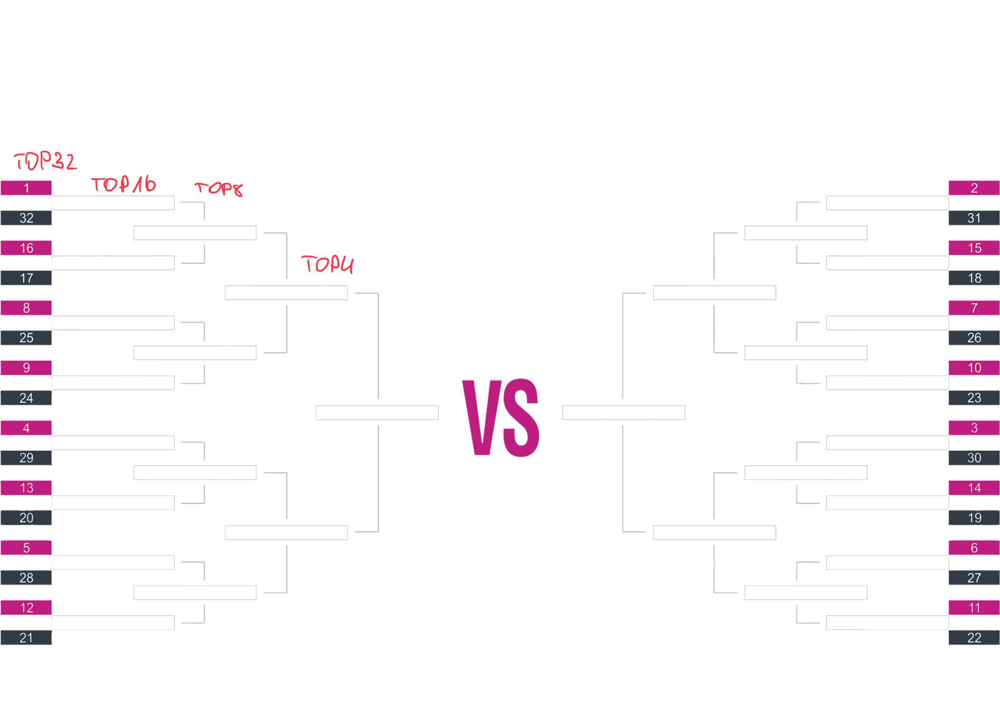
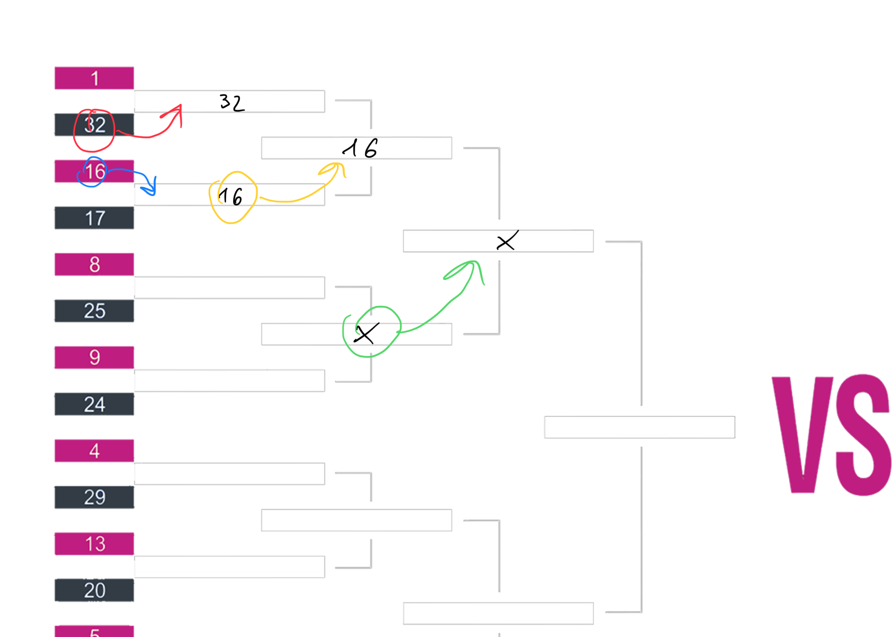
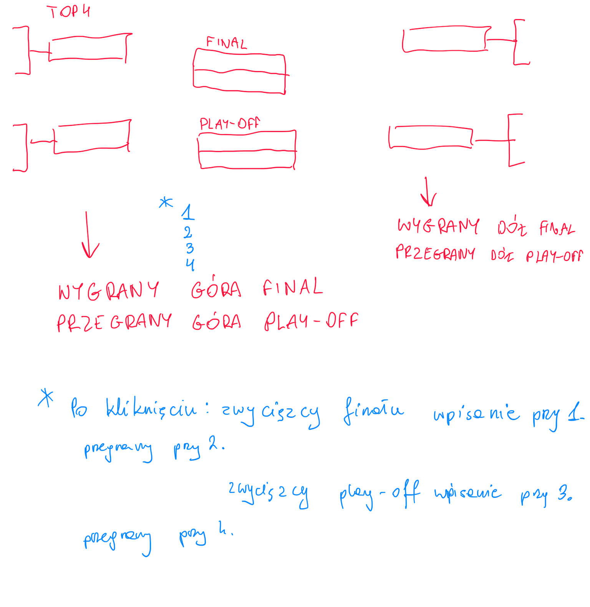

# Program do wyników i drabinka  
  
Może to być wersja na przeglądarki, ewentualnie jak się uda to aplikacja na Windows i MacOS.  
  
  
Potrzebna jest tabela, w której będzie można wpisać:  
  

| L.p. | Imię i nazwisko nr startowy | Wynik 1. przejazdu | Wynik 2. przejazdu |
| ---- | --------------------------- | ------------------ | ------------------ |
| 1.  |  |  |  |
  
  
Dobrze by było gdyby zawierała początkowo 2 wiersze i po uzupełnieniu następnego wiersza, pod spodem pojawiał się kolejny z następnym numerem w pierwszej kolumnie  
  

| L.p. | Imię i nazwisko nr startowy | Wynik 1. przejazdu | Wynik 2. przejazdu |
| ---- | --------------------------- | ------------------ | ------------------ |
| 1.  | XYZ |  |  |
| 2. | ABC |  |  |
| 3. |  |  |  |
  
  
Zależy nam na tym, aby program automatycznie generował kolejne tabele, w jednej wiersze bedą ustawione od najwyższego od najniższego wyniku z uwzględnieniem obydwu wyników. Ważne jest to, żeby w przypadku remisu wyżej był zawodnik, który w słabszym przejeździe osiągnął wyższy wynik np. :  
  

| Miejsce | Imię i nazwisko nr startowy | Wynik 1. przejazdu | Wynik 2. przejazdu |
| ------- | --------------------------- | ------------------ | ------------------ |
| 1.  | XYZ | 81 | 76 |
| 2. | ABC | 56 | 81 |
| 3. | OPR | 81 | 0 |
  
Dobrze gdyby wyższy wynik danego zawodnika był pogrubiony  
  
Tabela powinna mieć wiersze od 1 do 32. W przypadku wyników 0 i 0 należy wygenerować oddzielną tabelę zawierającą tylko wyniki zerowe z numeracją od 33. W przypadku zakwalifikowania się np 28 kierowców (conajmniej jeden wynik dodatni) w wierszach 29-32 powinny pojawić się myślniki.  
  
Następny krok programu ma za zadanie wygenerować drzewko Top32, w którym wpisane będą w odpowiednie miejsca imiona nazwisko i nr startowe według poniższego schematu  
  
  
Tym samym w nawiązaniu do zakwalifikowania się np 28 kierowców pola 29-32 powinny zawierać "-".  
  
Chcielibyśmy aby w przypadku pojedynków można było klikać na zwycięzcę w wyniku czego jego dane będą przenoszone do kolejnej komórki:  
  
  
Na nasze potrzeby trzeba tylko zmienić delikatnie środek:  
  
  
Na koniec chciałbym żeby dało się wygenerować w png (bez tła) tabelę wyników i drzewko Top32.  
